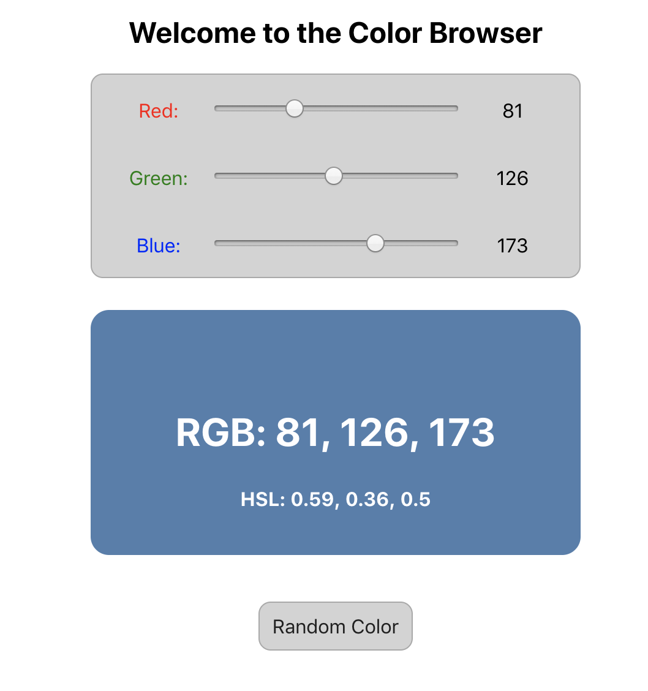

# Color Browser

This is a simple React application demonstrating both stateful and stateless React components.

A live demo is running [here](https://pages.github.homedepot.com/om-labs/React-Color-Browser-Demo/).

You can use this as a demo app or as a starter repo for some additional React exercises.

